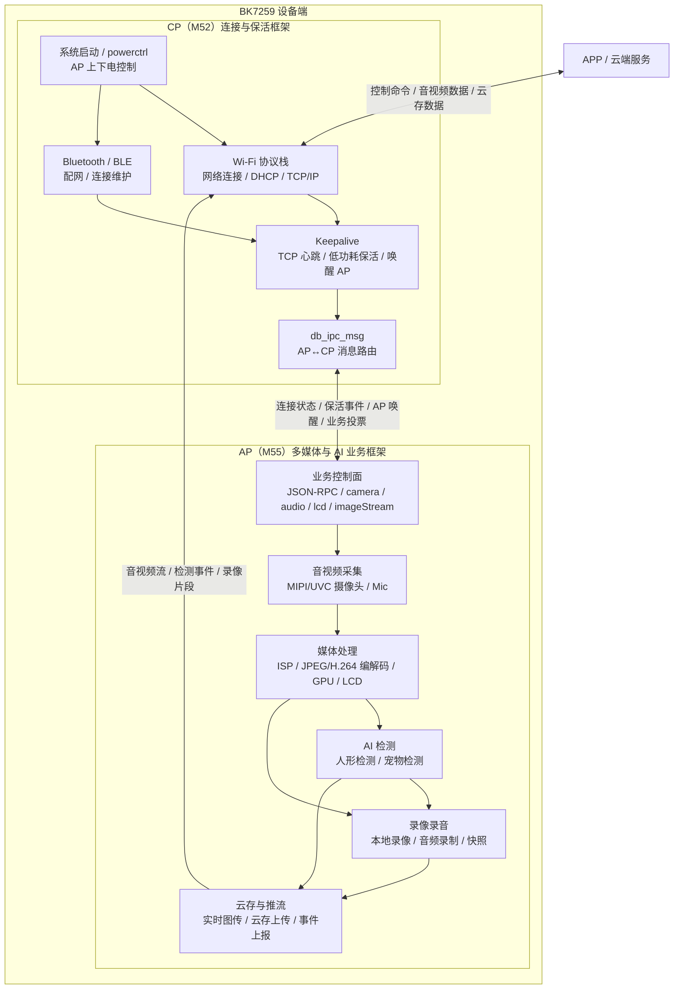

# video_intercom 项目（BK7259 SMP 双向可视对讲方案）

* [English](./README.md)

## 1 项目概述

本项目是 doorbell 解决方案中的 **双向可视对讲（two-way video intercom）方案**。相比标准 `doorbell`，它把设备控制面从二进制命令通道换成 **JSON-RPC 控制通道**，并在本机 LCD 上同时显示 **对端下行视频（主画面）** 与 **本机摄像头自拍画面（PIP 小窗）**，配合双向音频实现"可视对讲"。

**核心思路**：

- **上行（uplink）**：本机 MIPI 摄像头经 ISP → H.264 编码 → 网络发送到 APP/对端。
- **下行（downlink）**：从网络收到对端 H.264 视频 → 硬件解码 → GPU 合成 → 送 LCD 显示；对端音频 → 扬声器播放。
- **PIP 画中画**：ISP SP 通道输出本机自拍小窗，叠加在下行主画面右上角（微信视频通话风格）。
- **JSON-RPC 控制**：APP 通过 JSON-RPC 2.0 控制摄像头/音频/LCD/下行图流的开关与参数。

该方案通过 `components/smart_intercom` 组件实现，其与标准 `doorbell` 使用的 `smart_lock`（二进制控制通道）互斥；多媒体底层能力（摄像头、LCD、音频、图传、BLE 配网、CS2 P2P 等）与 `doorbell` 一致，详见 [doorbell 工程文档](../doorbell/index.html)。

CPU 分工：

- **AP**（M55）：运行全部多媒体与业务逻辑——ISP/编码/解码、GPU 合成、LCD、双向音频、BLE 配网、`doorbell_core` 状态机、JSON-RPC 控制面、下行解码与 PIP 合成。
- **CP**（M52）：`bk_init()` 后 `db_ipc_msg_init()` 初始化 IPC，`pl_wakeup_host()` 上电 AP；提供低功耗保活（keepalive / db_pack / powerctrl），**不调用** `bk_start_ap_system()`（与 `doorbell_lp` 的 CP 侧一致）。

## 2 功能特性

| 特性              | 说明                                                                       |
| ----------------- | -------------------------------------------------------------------------- |
| 双向可视对讲      | 上行本机摄像头 H.264 图传 + 下行对端 H.264 视频解码显示 + 双向音频          |
| JSON-RPC 控制面   | JSON-RPC 2.0 方法表调度，控制 camera/audio/lcd/imageStream/service         |
| 下行视频解码显示  | 网络 H.264 → 硬件解码 → HSRAM FLEXA 环 → GPU 缩放/旋转 → LCD               |
| PIP 画中画        | ISP SP 自拍画面（640×360）叠加在下行主画面右上角                          |
| 下行视频零拷贝    | `CONFIG_SMART_INTERCOM_DL_ZEROCOPY`：网络分片直接重组进解码槽，省去一次拷贝 |
| 低功耗保活        | 复用 CP 侧 keepalive（AP 掉电 + TCP 心跳），空闲时降功耗                    |

### 2.1 与标准 doorbell 的差异

| 对比项        | doorbell                        | video_intercom                                                     |
| ------------- | ------------------------------- | ----------------------------------------------------------------- |
| 控制通道      | 二进制命令（`smart_lock`）      | JSON-RPC 2.0（`smart_intercom`）                                   |
| 下行视频      | 无                              | 对端 H.264 解码 + GPU 合成显示                                     |
| LCD 画面      | 单路本机预览                    | 下行主画面 + 本机 PIP 小窗                                         |
| ISP 通道      | 仅 MP                           | MP（上行编码）+ SP（PIP 自拍）                                     |
| 组件          | `smart_lock`                    | `smart_intercom`（`depends on !SMART_INTERCOM` 使 smart_lock 关闭） |
| 关键 defconfig | 标准 doorbell                   | `CONFIG_SMART_INTERCOM*`、`CONFIG_NTWK_CTRL_CHAN_JSON`、H.264 QUALITY 预设 |

## 3 快速开始

### 3.1 硬件准备

- BK7259 开发板
- MIPI 摄像头（GC2053，1920×1080@15fps）
- MIPI LCD（HX8399C，1080×1920）
- Speaker / Mic（双向音频）

### 3.2 编译

```bash
cd projects/video_intercom
SDK_DIR=/abs/path/to/bk_avdk_smp_release_4.0.1 ./dbuild.sh make bk7259 PROJECT=video_intercom
```

产物：`projects/video_intercom/build/bk7259/video_intercom/package/all-app.bin`

### 3.3 关键配置项

`ap/config/bk7259_ap/defconfig` 中区别于标准 doorbell 的核心开关：

```ini
CONFIG_INTEGRATION_DOORBELL=y
CONFIG_SMART_INTERCOM=y                 # 启用 smart_intercom 组件
CONFIG_SMART_INTERCOM_DL_ZEROCOPY=y     # 下行视频零拷贝
CONFIG_NTWK_CLIENT_SERVICE_ENABLE=y
CONFIG_NTWK_CTRL_CHAN_JSON=y            # 控制通道走 JSON
CONFIG_NTWK_CTRL_JSON_RX_MAX_SIZE=8192
CONFIG_CJSON_USE=y
CONFIG_H264_QP_PRESET_QUALITY=y         # 2Mbps 画质预设
```

### 3.4 演示流程

1. 使用 BekenIot APK 完成 BLE 配网并连接设备（同 doorbell）。
2. APP 通过 JSON-RPC 打开 LCD、摄像头、音频，并下发下行图流接收配置。
3. 设备上行本机摄像头画面，同时解码并显示对端下行视频，本机自拍以 PIP 小窗叠加在右上角。
4. 双向音频接通，实现可视对讲。

## 4 工程目录

```
projects/video_intercom
├── ap/
│   ├── ap_main.c                 # AP 板级配置（MIPI 摄像头/LCD/GPU）+ doorbell 初始化
│   ├── audio_param/              # 音频参数
│   └── config/bk7259_ap/defconfig
├── cp/
│   ├── cp_main.c                 # CP：IPC 初始化 + pl_wakeup_host 上电 AP
│   ├── db_ipc_msg/               # AP↔CP IPC 消息路由
│   ├── db_pack/                  # 保活数据打包协议
│   ├── keepalive/                # CP 保活服务（TCP 心跳 + AP 掉电）
│   └── powerctrl/                # AP 上下电（pl_wakeup_host / pl_power_down_host）
├── partitions/bk7259/
├── CMakeLists.txt
├── Makefile
└── dbuild.sh
```

对讲业务代码在 `components/smart_intercom/`：

```
components/smart_intercom
├── include/                      # 公共头文件
├── src/
│   ├── doorbell_network_transfer.c   # 注册控制/视频/音频接收回调
│   ├── doorbell_config.c             # WiFi/Netif/BLE 事件与配网
│   ├── doorbell_cmd.c                # 心跳/上电通知、MM 状态投票
│   ├── doorbell_devices.c            # 上行通路：ISP→H.264→网络发送
│   ├── doorbell_jsonrpc.c            # JSON-RPC 2.0 引擎与方法分发
│   ├── doorbell_rpc_service.c        # service.setType（切换 TCP/UDP 服务）
│   ├── doorbell_rpc_camera.c         # camera.turnOn/turnOff/getStatus
│   ├── doorbell_rpc_audio.c          # audio.turnOn/turnOff/getStatus/setAcoustics
│   ├── doorbell_rpc_lcd.c            # lcd.turnOn/turnOff/getStatus
│   ├── doorbell_rpc_video_intercom.c # videoIntercom.turnOn/turnOff（双向图传一键开关）
│   ├── doorbell_rpc_misc.c           # misc.ping
│   ├── doorbell_rpc_solution.c       # solution.getConfig（能力上报）
│   ├── doorbell_downlink_img_manager.c # 下行 H.264 解码槽池
│   ├── doorbell_downlink_video.c     # 下行解码编排（含零拷贝注册）
│   ├── doorbell_display_compositor.c # PIP 合成器（主画面 + 自拍小窗）
│   ├── doorbell_isp_sp.c             # ISP SP 通道（自拍画面）
│   └── doorbell_keepalive.c          # AP 侧保活触发
```

## 5 实现机制

### 5.1 整体架构



职责边界：

- **CP 侧**负责 Wi-Fi、Bluetooth/BLE、TCP/IP 连接维护、低功耗保活、AP 上下电与 AP/CP IPC 消息转发。
- **AP 侧**负责摄像头/麦克风采集、ISP/编解码/GPU/LCD、多媒体业务控制、人形/宠物检测、录像录音、云存推流和事件上报。
- **AP 与 CP**通过 `db_ipc_msg` 同步连接状态、保活事件、AP 唤醒/关闭请求和业务投票；云端/APP 的网络入口由 CP 维护，AP 输出业务数据给 CP 转发。

### 5.2 上行通路（本机 → 网络）

```
MIPI GC2053 1080p@15
    ↓
ISP MP 256×144 NV12（flexa 通道）
    ↓
H.264 编码器（flexa bond）
    ↓
doorbell_devices_task_entry
    ↓
ntwk_trans_video_send() → APP/对端
```

由 JSON-RPC `doorbell.camera.turnOn`（携带 stream 配置）触发。

> **为什么是 256×144**：这是 HSRAM 无缝安全的"甜点"尺寸。256×144 恰为 9×16 行，可用一个约 55KB 的**整帧** FLEXA 环（`DL_SEG_NUM=9`），与 GPU 128KB 合成缓冲 + 上行编码 + PIP 同时放进 HSRAM。更大尺寸（如 512×288）整帧环约 221KB 放不下，被迫用浅环产生画面中段回绕，导致 h264d→GPU FLEXA bond 失步并触发 `VCDEC_DEC_INT_ERROR`。两个维度都必须是 16 的整数倍。

### 5.3 下行通路（网络 → 本机显示）

```
APP/对端 H.264 AU
    ↓
视频通道（零拷贝：直接重组进槽；否则 memcpy）
    ↓
doorbell_downlink_img_manager 就绪队列
    ↓
db_h264d 解码任务 → bk_h264_decode_frame → HSRAM FLEXA 环
    ↓
h264d→GPU bond → 合成器主画面（256×144 缩放到 1080p，旋转 90°）
    ↓
LCD 刷新（app_mipi_lcd_flush）
```

由 JSON-RPC `doorbell.imageStream.setReceiveConfig` 触发（需先打开 LCD）。进入下行显示前会 `doorbell_devices_preview_gpu_detach()` 释放单路预览 GPU/HSRAM，让合成器独占 GPU。

**音频下行**：`doorbell_bk_net_audio_recv()` → `doorbell_audio_data_callback()` → 扬声器播放（按 turnOn 参数选择 G.711/G.722/PCM）。

### 5.4 LCD 画面合成（PIP）

下行显示时的图层：

| 图层     | 来源                | 尺寸               | 位置                        |
| -------- | ------------------- | ------------------ | --------------------------- |
| 主画面   | 解码后的对端 H.264  | 256×144 → 全屏    | 铺满全屏                    |
| PIP 小窗 | ISP SP 自拍         | 640×360 NV12      | 右上角，边距 32px，旋转 90° |

上行编码在下行显示期间继续运行，仅预览 GPU 被分离。

### 5.5 下行视频零拷贝（`CONFIG_SMART_INTERCOM_DL_ZEROCOPY`）

网络分片重组层默认把 H.264 AU 从重组缓冲拷贝到下行解码槽（一次 `os_memcpy`）。开启零拷贝后，`doorbell_downlink_video.c` 向网络层注册 unfragment 回调，把解码槽以 `frame_buffer_t` 形式暴露给网络层，让分片**直接重组进解码槽**，省去这次拷贝：

| 回调       | 函数                                  | 作用                              |
| ---------- | ------------------------------------- | --------------------------------- |
| `malloc_cb` | `doorbell_downlink_slot_fb_alloc`     | 取一个空闲槽作为 `frame_buffer_t` |
| `send_cb`   | `doorbell_downlink_slot_fb_commit`    | AU 已在槽内，置长度并推入就绪队列 |
| `free_cb`   | `doorbell_downlink_slot_fb_release`   | 归还槽到空闲栈                    |

若注册失败（如通路未就绪）会优雅回退到拷贝路径。要求解码槽在注册前已建立（在下行启动时 `doorbell_downlink_img_manager_init`）。

### 5.6 JSON-RPC 控制面

**入口链路**：

```
对端 APP → 网络控制通道（JSON，CONFIG_NTWK_CTRL_CHAN_JSON）
    ↓
doorbell_bk_net_cntrl_recv()
    ↓
doorbell_jsonrpc_handle_cmd()  → cJSON_Parse → method 字符串
    ↓
方法表分发（15 项）→ 对应 doorbell_rpc_*.fn(params, id)
```

**方法表**：

| 方法                                                          | 说明                       |
| ------------------------------------------------------------- | -------------------------- |
| `doorbell.service.setType`                                    | 切换 LAN UDP/TCP 服务      |
| `doorbell.camera.turnOn` / `turnOff` / `getStatus`            | 单向图传（上行采集+本地预览）开关/状态 |
| `doorbell.audio.turnOn` / `turnOff` / `getStatus` / `setAcoustics` | 双向音频开关/状态/AEC 参数 |
| `doorbell.lcd.turnOn` / `turnOff` / `getStatus`               | LCD 开关/状态              |
| `doorbell.videoIntercom.turnOn` / `turnOff`                   | 双向视频对讲一键开关（上行采集传输 + 下行接收显示） |
| `doorbell.misc.ping`                                          | 存活探测                   |
| `doorbell.solution.getConfig`                                 | 上报设备能力               |

**出口**：处理器通过 `doorbell_rpc_send_result/error` → `ntwk_trans_ctrl_send()` 回包。设备侧还会主动发送 `doorbell.notify.heartbeat`（定时）与 `doorbell.notify.powerOn`（连接建立时）通知。

## 6 API 参考（`components/smart_intercom/include/`）

**JSON-RPC**（`doorbell_jsonrpc.h`）：

```c
int  doorbell_jsonrpc_handle_cmd(const char *json, int length);
void doorbell_jsonrpc_send_notify(const char *method, cJSON *params);
```

**下行视频**（`doorbell_downlink_video.h`）：

```c
bk_err_t doorbell_downlink_set_h264_receive_config(const doorbell_dl_recv_cfg_t *cfg);
bk_err_t doorbell_downlink_video_recv(const uint8_t *data, uint32_t length);
bk_err_t doorbell_downlink_video_stop(void);
bool     doorbell_downlink_video_is_running(void);
```

**PIP 合成器**（`doorbell_display_compositor.h`）：

```c
bk_err_t doorbell_compositor_start(const doorbell_comp_cfg_t *cfg, void *flexa_ring, uint32_t flexa_buf_count);
bk_err_t doorbell_compositor_stop(void);
bool     doorbell_compositor_is_running(void);
```

**ISP SP 自拍**（`doorbell_isp_sp.h`）：

```c
bk_err_t doorbell_isp_sp_open(uint16_t width, uint16_t height);
bk_err_t doorbell_isp_sp_read_nv12(frame_buffer_t *frame, uint32_t size, uint32_t timeout_ms);
bk_err_t doorbell_isp_sp_close(void);
```

**对讲设备扩展**（`doorbell_devices_intercom.h`）：

```c
void *doorbell_devices_isp_handle_get(void);
void  doorbell_devices_preview_gpu_detach(void);
void  doorbell_devices_preview_gpu_attach(void);
void  doorbell_devices_force_idr(void);
```

## 7 常见问题

**Q: video_intercom 和 doorbell 能同时编到一个固件吗？**

A: 不能。`smart_intercom` 的 Kconfig 使 `smart_lock` 满足 `depends on !SMART_INTERCOM` 而被关闭，二者互斥。启用 `CONFIG_SMART_INTERCOM=y` 时 `smart_lock` 编译为空库。

**Q: 下行视频尺寸为什么固定 256×144？能放大吗？**

A: 受 HSRAM 大小限制。256×144 是能放下整帧 FLEXA 环的 HSRAM 安全尺寸；放大会导致环回绕、h264d→GPU 失步、解码报 `VCDEC_DEC_INT_ERROR`。两维都须为 16 的倍数。

**Q: 控制通道用的是什么协议？**

A: JSON-RPC 2.0（`CONFIG_NTWK_CTRL_CHAN_JSON=y`），区别于标准 doorbell 的二进制命令通道。
